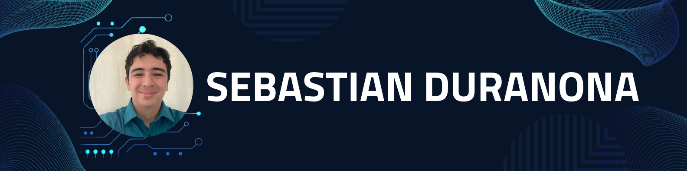

# Welcome to my Portfolio

Welcome to my GitHub portfolio, where I showcase my journey in the world of cybersecurity and fraud, with a focus on Trust and Identity Management. I'm Sebastian, a passionate computer science student with a strong desire to strengthen my knowledge in Information security. My goal is to become a Penetration Tester specializing in Identity Management Systems and pave the way to a safer, more trustworthy Internet. 

## 🚀 What You'll Find Here

<!-- - **C Programming Projects**: Explore my [C programming](https://github.com/SebasDuranona/CodeVault_C) projects. -- (UNDER CONSTRUCTION) -->
- **Networking Projects**: Here you will find some basic/intermediate projects that focus on [Computer Networking](https://github.com/SebasDuranona/Networking) topics.
- **Data Structures Tutorial**: Dive into my [data structures](https://github.com/SebasDuranona/DSVault/tree/main/DSTutorials) tutorial.
  
- **SandhillScapegoat Blog**: Check out the [SandhillScapegoat](https://sandhillscapegoat.substack.com/) blog, where I share insights, case studies, and tutorials on topics related to Trust, Identity Management, and more.

## 📬 Let's Connect

I'm always eager to connect with fellow cybersecurity enthusiasts, professionals, and anyone interested in the field. Feel free to reach out to me on [LinkedIn](https://www.linkedin.com/in/sebastian-gomez-duranona-46bb87185/).

## 🌱 Stay Updated

Stay tuned for regular updates as I continue to expand my portfolio and share my insights on cybersecurity

Thank you for visiting, and I look forward to sharing my cybersecurity journey with you!

